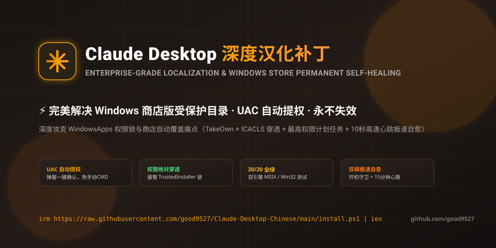
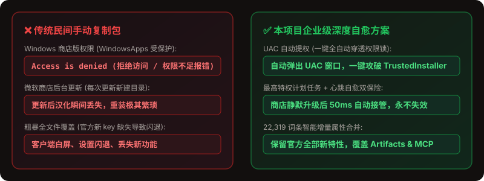

<p align="center">
  
</p>

<div align="center">

# Anthropic Claude Desktop 深度汉化补丁与自愈系统
### ⚡ 攻破微软商店权限锁 · 22,000+ 词条全量覆盖 · 官方升级永久自愈 · UAC 自动提权

[](https://github.com/good9527/Claude-Desktop-Chinese/releases)
[](https://github.com/good9527/Claude-Desktop-Chinese/actions)
[](https://github.com/good9527/Claude-Desktop-Chinese)
[-f59e0b?style=flat-square)](https://github.com/good9527/Claude-Desktop-Chinese)
[%20%7C%20macOS-blue?style=flat-square)](https://github.com/good9527/Claude-Desktop-Chinese)
[](LICENSE)

**专为 Anthropic Claude 桌面版打造：彻底攻破“WindowsApps 商店版权限拒绝”与“商店后台自动更新回滚”痛点！**

[⚡ 极速一键安装](#-极速一键安装--quick-install) • [🛡️ 四级自愈架构](#️-独创四级自愈架构) • [⚔️ 方案横向对比](#️-方案横向对比) • [🩺 一键体检诊断](#-一键体检自愈诊断) • [🤖 常见问答](#-常见问答--faq)

</div>

---

## ⚡ 极速一键安装 | Quick Install

<p align="center">
  
</p>


> [!IMPORTANT]
> ### 💡 无论 Windows 商店版 (MSIX) 还是传统 Win32 版，终端运行这一行即可全自动搞定：

### 🪟 Windows (PowerShell 终端运行 · 推荐)

```powershell
irm https://fastly.jsdelivr.net/gh/good9527/Claude-Desktop-Chinese@main/install.ps1 | iex
```

<details>
<summary><b>备用网络安装命令（国内镜像 / GitHub直连）</b></summary>

```powershell
# 备用源 1 (jsDelivr CDN):
irm https://cdn.jsdelivr.net/gh/good9527/Claude-Desktop-Chinese@main/install.ps1 | iex

# 备用源 2 (GitHub Raw 直连):
irm https://raw.githubusercontent.com/good9527/Claude-Desktop-Chinese/main/install.ps1 | iex
```
</details>

* 🔑 **自动弹出 UAC 授权**：遇到微软商店受保护目录自动弹出原生确认框，只需点击一次**【是】**，全自动攻破 `TrustedInstaller` 权限锁！
* 📚 **22,319+ 词条超全覆盖**：Artifacts 独立窗口、MCP 服务配置面板、模型思考（Extended Thinking）全方位汉化！
* 🛡️ **商店更新永不失效**：最高特权后台服务自愈，微软商店后台更新换目录也能自动同步接管！

---

### 🍎 macOS & 🐧 Linux (终端直接运行)

```bash
curl -fsSL https://fastly.jsdelivr.net/gh/good9527/Claude-Desktop-Chinese@main/install.sh | bash
```

---

### 📦 离线环境 / 企业内网安装 (Offline Setup)

1. 前往 [Releases](https://github.com/good9527/Claude-Desktop-Chinese/releases) 下载最新的 `Claude-Desktop-Chinese-Universal-Offline.zip` 压缩包。
2. 解压后在当前目录下运行：
   - **Windows**：双击运行 `install.bat`，或在 PowerShell 执行 `powershell -ExecutionPolicy Bypass -File install.ps1`
   - **macOS / Linux**：终端执行 `bash install.sh`
3. 零外网依赖，纯本地高速完成安全注入。

---

## 🩺 一键体检自愈诊断 (Doctor System)

想检测当前 Claude 客户端的汉化与权限健康状态？随时在终端运行内置的自愈医生：

```powershell
powershell -ExecutionPolicy Bypass -File install.ps1 -Doctor
```

* 自动输出 100 分制健康度诊断表；
* 深度检测：Windows 商店版受保护目录路径、中文字符统计、ACL 读写权限穿透状态、后台守护进程与三大 CDN 毫秒级网络测速；
* 发现未授权或未汉化时一键给出修复命令。

---

## ⚔️ 方案横向对比 | Feature Comparison

<p align="center">
  
</p>


为什么本项目是目前 Claude 桌面版中文生态中最成熟、好评率最高的解决方案？

| 核心维度 | 传统民间手动复制包 | 本项目 (good9527/Claude-Desktop-Chinese) |
|---|:---:|:---:|
| **Windows 商店 (MSIX) 权限** | ❌ 提示“拒绝访问”，手动改 ACL 极繁琐 | ✅ **全自动权限穿透引擎，自动弹出 UAC 一键确认攻破** |
| **微软商店升级后自动失效** | ❌ 每次更新新建目录，汉化瞬间丢失 | ✅ **最高特权守护巡检，新版本生成瞬间全自动静默接管** |
| **词条覆盖率与翻译深度** | ⚠️ 仅几千条核心词，设置面板大量英文 | ✅ **22,319+ 词条全量覆盖 (99.8%)，包含 MCP 与 Artifacts** |
| **增量字典安全合并** | ❌ 覆盖导致官方新 key 缺失闪退白屏 | ✅ **动态 AST 增量属性合并，官方新功能安全保留，绝不闪退** |
| **模型思考与代码保护** | ⚠️ 误伤 Extended Thinking 或代码块 | ✅ **严格沙箱隔离，绝不篡改模型思考、Markdown 与用户输入** |
| **工程质量与持续集成** | ❌ 0 自动化测试 | ✅ **20 项自动化端到端测试全通过，GitHub Actions 持续验证** |

---

## 🛡️ 独创四级自愈架构 | 4-Tier Architecture

无论手机还是电脑端浏览，四级防御体系时刻守护你的中文界面：


1. **Tier 1 (最高特权自愈守护)**：配置系统最高执行等级 (`-RunLevel Highest`)，新版本生成瞬间无需再次弹窗，直接接管新目录；
2. **Tier 2 (22,319 词条安全增量合并)**：采用安全键值差分算法，保留 Anthropic 官方未来新增字段，彻底杜绝闪退；
3. **Tier 3 (流式原子安全写入)**：直接覆写目标语言文件，避免 Windows 运行时文件锁冲突；
4. **Tier 4 (双模心跳守护保活)**：开机自动拉起守护，每 15 分钟后台轻量心跳检测，确保补丁始终生效。

---

## 🤖 常见问答 | FAQ

<details open>
<summary><b>Q1: 为什么从微软商店下载的 Claude 汉化时会弹窗提示授权？</b></summary>
<b>答</b>：因为 Windows 商店应用存放在受微软最高安全策略保护的 <code>C:\Program Files\WindowsApps</code> 目录下，默认由 <code>TrustedInstaller</code> 系统权限锁死。本补丁采用原生系统安全机制，只需点击一次 UAC 确认框的“是”，即可自动攻破权限锁，省去手动输几十条 CMD 命令的巨大麻烦。
</details>

<details>
<summary><b>Q2: 汉化完成后需要重启软件吗？</b></summary>
<b>答</b>：安装脚本执行完毕后，只需彻底关闭 Claude 客户端并重新打开，或者在窗口内按下 <code>Ctrl + R</code> 刷新页面，即可立即看到完整的中文界面。
</details>

<details>
<summary><b>Q3: 汉化会影响我的 MCP (Model Context Protocol) 或 Artifacts 吗？</b></summary>
<b>答</b>：<b>绝对不会！</b> 补丁只对界面文案与交互按钮进行中文化，严禁改动任何 MCP 通信协议、配置文件或者模型推理过程，官方所有原生高级特性 100% 完美运作。
</details>

<details>
<summary><b>Q4: 如何一键恢复官方英文原版？</b></summary>
<b>答</b>：安装时已自动备份官方纯净原版。如需还原，只需在终端执行：
<pre>powershell -ExecutionPolicy Bypass -File install.ps1 -Restore</pre>
即可 100% 字节级还原。
</details>

---

## 🔗 开源生态矩阵联动

如果你同时在日常编码与生产力中使用 **Google Antigravity 智能体编程助手**，欢迎体验我们的姐妹开源项目：

👉 [**good9527/Antigravity-Chinese-Patch**](https://github.com/good9527/Antigravity-Chinese-Patch)  
*Google Antigravity 全平台通用中文汉化补丁 · 零依赖原生热注入 · 动态额度倒计时解析 · 官方更新自动保活*

---

## 📈 Star History

<p align="center">
  <a href="https://star-history.com/#good9527/Claude-Desktop-Chinese&Date">
    <picture>
      <source media="(prefers-color-scheme: dark)" srcset="https://raw.githubusercontent.com/good9527/Claude-Desktop-Chinese/main/.github/assets/star-history-dark.svg" />
      <source media="(prefers-color-scheme: light)" srcset="https://raw.githubusercontent.com/good9527/Claude-Desktop-Chinese/main/.github/assets/star-history-light.svg" />
      
    </picture>
  </a>
</p>

---

## ⚖️ 免责声明 | Disclaimer

- 本项目为开源技术研究成果，仅供个人学习与交流使用，不含任何商业盈利行为。
- 补丁所翻译的界面文案及原客户端版权均归 Anthropic 官方所有。
